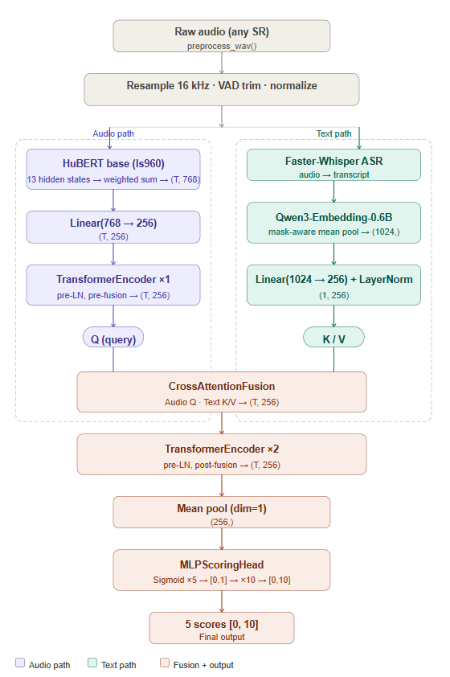
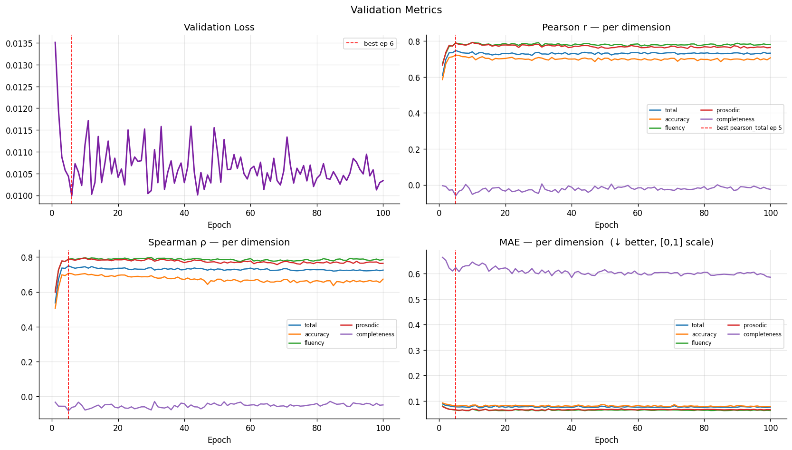
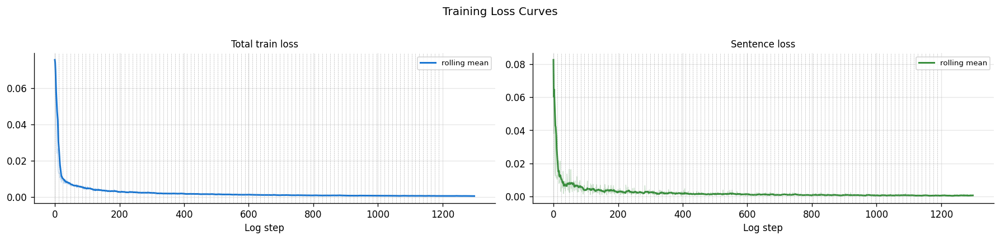
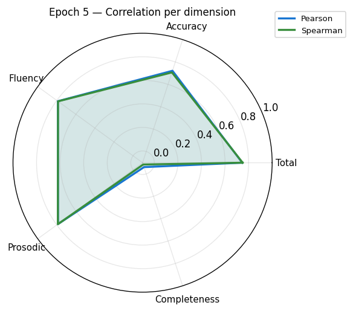
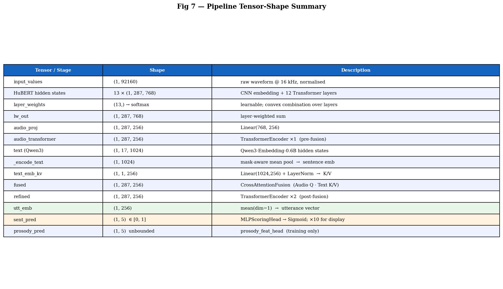

# English Pronunciation Scoring

End-to-end pronunciation scoring pipeline trained on [SpeechOcean762](https://huggingface.co/datasets/mispeech/speechocean762).
Combines a layer-weighted HuBERT encoder, a frozen Qwen3 text encoder, cross-attention fusion, and a deep MLP scoring head to predict five utterance-level pronunciation dimensions.

## Architecture



```
Raw audio (any SR)
  └─ preprocess_wav()  →  resample 16 kHz · VAD trim · zero-mean/unit-std
       │
       ▼  Audio path
  HuBERT (facebook/hubert-base-ls960)
    13 hidden states  →  learnable layer-weighted sum  →  (T, 768)
    Linear(768, 256)                                   →  (T, 256)
    TransformerEncoder ×1  (pre-LN, pre-fusion)        →  (T, 256)
       │
       │  Text path (parallel)
       │  Faster-Whisper ASR  →  transcript
       │  Qwen3-Embedding-0.6B  →  mask-aware mean pool  →  (1024,)
       │  Linear(1024, 256) + LayerNorm                  →  (1, 256)  [K/V]
       │
       ▼
  CrossAttentionFusion  (Audio Q · Text K/V)           →  (T, 256)
  TransformerEncoder ×2  (pre-LN, post-fusion)         →  (T, 256)
  mean(dim=1)                                          →  (256,)
       │
       ├─ MLPScoringHead  →  Sigmoid × 5  →  [0,1]  →  ×10  →  [0,10]
```

**Output dimensions** (SpeechOcean scale 0–10):

| Dimension | Description |
|-----------|-------------|
| `total` | Overall pronunciation quality |
| `accuracy` | Phonetic accuracy |
| `fluency` | Speech fluency and naturalness |
| `prosodic` | Prosody, rhythm, and stress |
| `completeness` | Utterance completeness |

## Results

Trained on `mispeech/speechocean762` train split, evaluated on test split.
Best checkpoint at epoch 10 (selected by `pearson_total`).

### Utterance-level Pearson correlation (PCC ↑) on SpeechOcean762

| Model | total | accuracy | fluency | prosodic |
|-------|------:|--------:|--------:|--------:|
| HuBERT Base + BLSTM *(Kim et al., 2022)* | — | — | 0.74 | 0.73 |
| **HuBERT Large + BLSTM** *(Kim et al., 2022)* | — | — | **0.78** | **0.77** |
| HierTFR *(Yan et al., ACL 2024)* | 0.764 | 0.735 | 0.801 | 0.795 |
| **Ours** (HuBERT-base + Qwen3 + CrossAttn) | 0.740 | 0.714 | 0.792 | 0.791 |

> Kim et al. (2022) report only fluency and prosodic for SpeechOcean762.
> HierTFR uses HuBERT Large + a hierarchical Transformer trained with phone/word/utterance supervision.
> Our model uses HuBERT Base (smaller backbone) with a single utterance-level MLP head and no phone-level labels.

### Full metrics (this work)

| Metric | total | accuracy | fluency | prosodic |
|--------|------:|--------:|--------:|--------:|
| Pearson r | 0.740 | 0.714 | 0.792 | 0.791 |
| Spearman ρ | 0.745 | 0.705 | 0.796 | 0.795 |
| MAE (÷10) | 0.079 | 0.084 | 0.068 | 0.068 |

> `completeness` is excluded from training loss — SpeechOcean learners score 10/10 almost universally, which collapses the head to a constant predictor.





### Model statistics





## Quick Start

### Training

```bash
python models/train.py \
  --dataset mispeech/speechocean762 \
  --epochs 100 \
  --batch_size 4 \
  --lr 2e-5 \
  --out_dir ckpt_hubert_multitask
```

Key training arguments:

| Argument | Default | Description |
|----------|---------|-------------|
| `--epochs` | 5 | Number of training epochs |
| `--batch_size` | 4 | Batch size |
| `--lr` | 2e-5 | AdamW learning rate |
| `--d_model` | 256 | Shared projection dimension |
| `--num_heads` | 8 | Attention heads |
| `--num_audio_transformer_layers` | 1 | Pre-fusion self-attention depth |
| `--num_transformer_layers` | 2 | Post-fusion Transformer depth |
| `--mlp_hidden_layers` | 2 | MLP hidden blocks |
| `--num_unfreeze_hubert_layers` | 12 | HuBERT backbone layers to unfreeze (12 = full) |
| `--w_pfeat` | 0.0 | Auxiliary prosody loss weight (0 = disabled) |
| `--patience` | 3 | Early stopping on `pearson_total` |
| `--text_model` | `Qwen/Qwen3-Embedding-0.6B` | Text encoder (empty string to disable) |
| `--no_freeze_text` | — | Fine-tune text encoder (frozen by default) |

Best checkpoint is saved to `{out_dir}/best.pt` (selected by `pearson_total`).
Training metrics are logged to `{out_dir}/result.csv`.

### CLI Inference

```bash
python -m inference.infer \
  --wav data/learner/01_learner.wav \
  --checkpoint ckpt_hubert_multitask/best.pt \
  --lang en
```